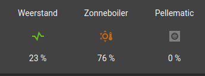
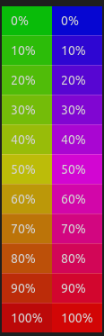
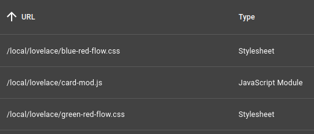

<link rel="stylesheet" href="green-red-flow.css"/>
<link rel="stylesheet" href="blue-red-flow.css"/>

# Colored Icons

The idea is that when you have a state, you can pick between a 100 colors and you can calculate the precise color you want to use. The result could look like



## How to achieve this

To do this I rely on [card-mod](https://github.com/thomasloven/lovelace-card-mod) by Thomas Loven. A nice addition that allows you to change the icon and the icon color depending on the state.

```yaml
type: vertical-stack
  - some_stuff: deleted
  - type: glance
      - entity: select.oekofen_verwarming_mode_auto
        card_mod:
          style: |
            :host {
              
              --card-mod-icon-color: 
              
                 black
              
                 green
              
                 red
              
                 grey
              
              ;
            }
```

This colors the icon black, green, red or grey depending on the state.

This directory contains 2 files each containing 101 color definitions:

* one evolving from green over yellow to red
* one evolving from blue over magenta to red

These colors are named

* `--green-red-flow--p<n>`
* `--blue-red-flow--p<n>`

where `<n>` varies between 0 and 100. By transforming the state into a number between 0 and 100, you can get a very dynamic icon color.

```yaml
      - entity: sensor.oekofen_pe1_modulation
        card_mod:
          style: |
            :host {
              
              --card-mod-icon-color: 
              
                 grey
              
                 var(--green-red-flow--p{{v}})
              
              ;
            }
```

Here, I show grey if the *Pellematic* is not working, and a relative color when it is working:

* greenish when it is working at low percentage
* yellowish around 50%
* red-ish when it reached 80% or higher.

The table below shows how these colors evolve.

   

## How to install

1. Make sure you installed Card-mod as explained in the link above

2. Copy the 2 css files in this directory to the `www` directory of your HA installation. This may vary depending on how you installed HA on your system. Please consult the appropriate HA documentation

3. In the HA user interface: goto *Configuration*/*Dashboards*/*Resources*. Here you need to add the 2 files you copied by click *add resource*. 
   * If you don't find the resources tab, you must set advanced mode on your user in HA.
   * Don't forget to replace the `www` directory by `/local`as described in the HA documentation.
   * The result of this action should look like
   
   

4. Now you are ready to use the color schemes.